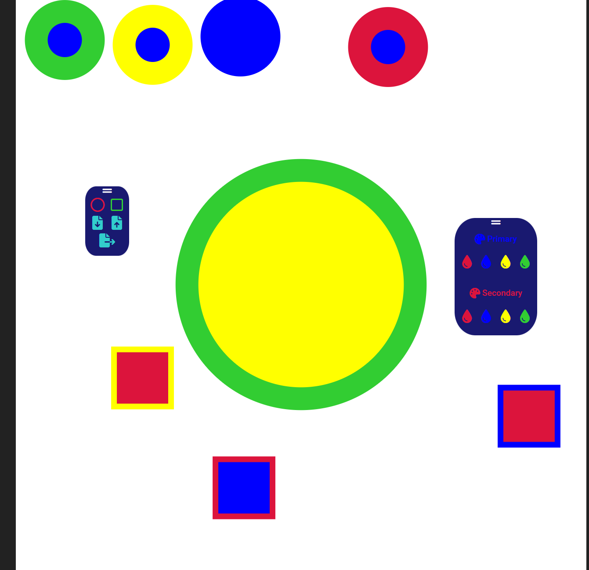

This is going to be an SVG Editor, but it will take a while
============
Currently, this is unusable if you don't want to copy some code.
If you, for some reason, want this, it'll come out in ~1 year if I don't quit, and it's quite probable for me to do that.

# Core Features
- Lightweightnes - The goal is to merge everything into a single directory at the end, so there should not be any huge file dependencies
- Controllability - Libraries shall be kept at a minimum, and they should be somewhat well known
- Simplicity - This should not end up like photoshop where you need to watch a 5-minute tutorial for everything you try to do
- Client side only - This should not have to be maintained anywhere, it should just be able to be opened in a browser
- Good look - just make the ui look good, no one wants half-finished ui

## Preview Screenshot (will be updated)
